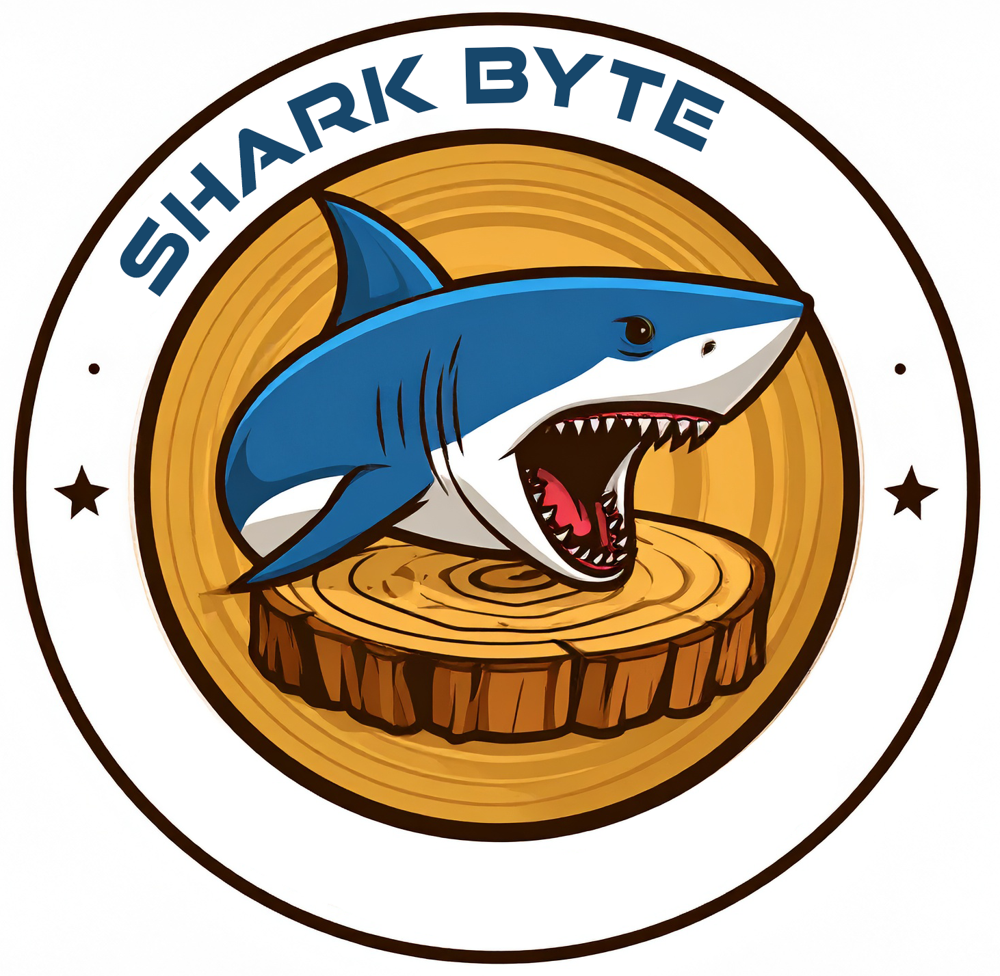

# SharkByte 🦈



## Open-source CAM for CNC Shark routers

SharkByte is a specialized CAM (Computer-Aided Manufacturing) tool optimized for CNC Shark HD4 routers. It's a fork of the excellent Kiri:Moto project by Stewart Allen, tailored specifically for the needs of CNC Shark users who need a powerful, free alternative to VCarve Pro.

### Why SharkByte?

- **Free & Open Source**: No licensing fees or subscriptions
- **Browser-Based**: Run it locally or host it on your network
- **Shark-Optimized**: Pre-configured for CNC Shark HD4 with proper post-processing
- **TAP File Export**: Native support for .tap files with GRBL-compatible G-code
- **Active Development**: Regular updates and community support

### Features

- ✅ Full 2.5D and 3D toolpath generation
- ✅ Multiple operation types (roughing, finishing, drilling, contouring)
- ✅ Arc support (G2/G3 commands) for smoother cuts
- ✅ Manual tool change workflow optimized for Shark HD4
- ✅ Inch-based measurements (G20) by default
- ✅ Visual toolpath preview
- ✅ Support for common router bits (1/4", 1/2", 1/8" shanks)

### Quick Start

1. **Clone the repository:**
   ```bash
   git clone https://github.com/JarettHall/SharkByte.git
   cd SharkByte
   ```

2. **Install dependencies:**
   ```bash
   npm install
   ```

3. **Run in development mode:**
   ```bash
   npm run dev
   ```

4. **Open in browser:**
   Navigate to `http://localhost:8080`

5. **Select your machine:**
   Go to Setup → Device → Select "CNC Shark HD4"

### Machine Specifications

**CNC Shark HD4:**
- Work area: 25" × 25" × 7" (635mm × 635mm × 178mm)
- Controller: GRBL-based with LCD pendant
- Spindle: Up to 27,000 RPM
- File format: .tap (G-code with arc support)

### Documentation

- **📖 User Guide**: [SHARKBYTE_USER_GUIDE.md](SHARKBYTE_USER_GUIDE.md) - Complete usage instructions
- **🔧 Setup Guide**: [SHARK_HD4_SETUP.md](SHARK_HD4_SETUP.md) - Machine-specific setup
- **📋 Rebranding**: [REBRANDING_CHECKLIST.md](REBRANDING_CHECKLIST.md) - Development notes
- **🎯 Original Docs**: [Kiri:Moto Documentation](https://docs.grid.space/kiri-moto/)

### Contributing

We welcome contributions! Whether you're fixing bugs, adding features, or improving documentation, please see our [CONTRIBUTING.md](CONTRIBUTING.md) guide.

### Support

- **Issues**: [GitHub Issues](https://github.com/JarettHall/SharkByte/issues)
- **Discussions**: [GitHub Discussions](https://github.com/JarettHall/SharkByte/discussions)
- **User Guide**: [Complete SharkByte Documentation](SHARKBYTE_USER_GUIDE.md)

### Attribution

SharkByte is a fork of [Kiri:Moto](https://github.com/GridSpace/grid-apps) by Stewart Allen.

The original Kiri:Moto project is a comprehensive slicing and CAM tool supporting 3D printing, CNC milling, laser cutting, and more. We are grateful for Stewart's incredible work and the open-source foundation it provides.

### License

MIT License - See [LICENSE](LICENSE) file for details

Original work Copyright (c) Stewart Allen <sa@grid.space>
Fork modifications Copyright (c) 2024 Jarett Hall

---

**Built with ❤️ for the CNC Shark community**

*Making professional CAM accessible to everyone*